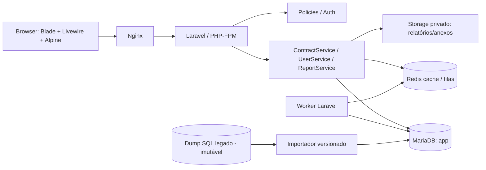

# Sistema Web de Gestão de Contratos — Especificação Funcional e Técnica

**Versão:** 1.0 (base de desenvolvimento)  
**Data-base:** 09/10/2026  
**Contexto:** gestão de contratos administrativos municipais  
**Fonte de dados:** `u910323952_bdgestao_niq.sql` (exportação MariaDB 11.8.9)  
**Estado:** especificação; não é sistema implementado.

> **Legenda:** **[SOLICITADO]** = pedido expresso; **[PROPOSTO]** = decisão de projeto recomendada; **[PENDENTE]** = regra que deve ser homologada pelo responsável antes de entrar em produção. Nenhuma sugestão altera automaticamente o significado dos dados legados.

## 1. Objetivo

Construir aplicação web responsiva para cadastrar, consultar, atualizar e remover logicamente contratos, autenticando administradores e usuários comuns, administrando usuários e emitindo relatórios. A estrutura contratual deve **abranger todos os campos** de `TB_Contratos`, sem perdas na migração. Aditivos e tabelas relacionadas deverão ser considerados para consultas e cálculos corretos, embora o CRUD completo desses módulos possa ser implantado em etapas posteriores.

### 1.1 Escopo mínimo (MVP)

1. Login, logout, recuperação/redefinição segura de acesso e controle de sessão.
2. Perfil administrador e perfil usuário comum, com autorização conferida no servidor.
3. Cadastro, listagem, detalhes, edição e **exclusão lógica** de contratos.
4. Tela administrativa de criar, listar, visualizar, editar, desativar e excluir logicamente usuários.
5. Relatórios de contratos por período, fornecedor, secretaria, fundo, modalidade, tipo, vigência e situação; exportação PDF, XLSX e CSV.
6. Importação controlada das tabelas necessárias do SQL legado, preservando IDs históricos e valores originais.
7. Rastreabilidade: usuário, data e alterações relevantes; logs de autenticação e exportações de dados pessoais.
8. Interface com aparência de aplicação administrativa moderna, inspirada em shadcn/ui e compatível com Livewire + Alpine.

### 1.2 Fora do MVP, mas previstos na arquitetura

- CRUD completo de aditivos e cálculos patrimoniais/financeiros complexos após homologação das regras de negócio.
- Emissão de minutas de contratos, termos aditivos, empenhos ou assinatura eletrônica.
- Integração com PNCP, portais contábeis, e-mails e sistemas de tramitação.
- Pagamentos, liquidações, execução contábil e controle financeiro operacional.
- Alertas por e-mail, calendário de vencimentos e anexos/arquivos em repositório digital — recomendados como fase 2.

**Importante:** não inferir que o conteúdo do SQL comprova situação jurídica atual, regularidade, empenhos, publicações ou saldos; os registros representam o estado exportado do sistema anterior.

## 2. Stack tecnológica

| Camada | Escolha | Diretriz |
|---|---|---|
| Backend | Laravel **13.x**, PHP **8.3+** | Adotar versões de manutenção suportadas; regras no servidor |
| UI dinâmica | **Livewire 4.x** + Blade | Formulários, tabelas, filtros, modais e navegação |
| Interações locais | **Alpine.js** | Menus, popovers e estados de exibição; **não carregar Alpine duas vezes**, pois Livewire já o integra |
| Estilo | **Tailwind CSS 4.x** | Design tokens, layout responsivo e tema escuro opcional |
| Componentes | **Flux UI (camada Livewire)** e/ou biblioteca Blade própria | Estética orientada a shadcn; componentes em Blade; não instalar pacote React shadcn/ui |
| Ícones | Lucide em componentes Blade / SVG locais | Consistência visual |
| Banco de dados | MariaDB, ambiente compatível com o dump **11.8.9** | Banco aplicativo próprio, isolado do legado |
| Cache / filas | Redis (recomendado) | Geração assíncrona de relatórios grandes, quando necessário |
| Infraestrutura | Docker Compose | PHP-FPM, Nginx, banco, worker, scheduler, Redis e build Node/Vite |
| Autenticação | Laravel session guard, hashes Argon2id ou bcrypt | Sem reaproveitar as senhas legadas |
| Testes | Pest/PHPUnit, Livewire tests e testes HTTP | Incluindo autorização e migração |
| Exportação | Biblioteca Laravel compatível e aprovada em `composer.lock` | PDF renderizado de Blade, XLSX e CSV streaming |

**Nota sobre shadcn/ui:** os componentes oficiais são voltados ao ecossistema React. Como a stack foi definida com Livewire/Alpine, o requisito é **equivalência de linguagem visual e comportamento**, não instalação direta dos componentes React. Flux UI é uma opção compatível com Livewire, com componentes gratuitos e opções pagas; avaliar licenças antes de usar componentes Pro.

Referências de implementação: [Laravel 13](https://laravel.com/docs/13.x/releases), [Livewire 4](https://livewire.laravel.com/docs/4.x/installation), [Flux UI](https://fluxui.dev/docs/installation), [Docker com Laravel](https://docs.docker.com/guides/laravel/), [shadcn/ui Laravel (com React)](https://ui.shadcn.com/docs/installation/laravel).

## 3. Perfis, autorização e segurança de acesso

### 3.1 Perfis

- **Administrador:** gerencia contratos em todos os órgãos autorizados e gerencia usuários, incluindo permissões, bloqueio e reativação.
- **Usuário comum:** consulta e gerencia contratos **somente nos fundos/secretarias autorizados**; por padrão não gerencia usuários e não exclui contratos.

A matriz a seguir é **proposta**. O solicitante não definiu quais ações de contrato serão exclusivas do administrador, portanto este detalhe é **[PENDENTE]** para homologação. A possibilidade técnica de conceder exclusão lógica ao usuário comum pode ser incluída por permissão individual, mas deve vir desabilitada.

| Ação | Administrador | Usuário comum (padrão) |
|---|---|---|
| Entrar/sair do sistema | Sim | Sim |
| Ver dashboard | Todos os órgãos | Apenas escopo atribuído |
| Listar/ver contrato | Sim | Sim, com filtro obrigatório por escopo |
| Criar contrato | Sim | Sim, nos órgãos autorizados |
| Editar contrato | Sim | Sim, nos órgãos autorizados |
| Excluir logicamente contrato | Sim | Não; permissão excepcional configurável |
| Restaurar registro excluído | Sim | Não |
| Cadastrar/editar/desativar usuários | Sim | Não |
| Ver auditoria completa | Sim | Não |
| Emitir relatórios | Sim | Sim, somente dos próprios órgãos |
| Exportar dados pessoais completos | Sob autorização justificada | Não por padrão |

### 3.2 Diretrizes

- `Gate` e `Policy` do Laravel em **cada ação**, inclusive métodos Livewire, endpoints de exportação e ações em lote; ocultar botão não é autorização.
- Associar usuário a **0..N fundos/secretarias** autorizados em tabelas relacionais próprias; administradores podem ser globais ou limitados, conforme política.
- Não permitir que usuário altere diretamente seu `role`, `status` ou `scopes`.
- Evitar que o último administrador ativo se desative ou seja excluído.
- Rate limit no login; proteção CSRF, validação server-side, cookies seguros, sessão regenerada após login e logout que invalida sessão.
- Senhas novas com hash seguro, senha forte e recuperação com token expiráveis; MFA para administradores é altamente recomendado.
- Mascarar CPF/RG e informações sensíveis em resultados não necessários ao trabalho; relatórios devem respeitar o mesmo escopo da tela.
- Logs não devem armazenar senhas, cookies, tokens ou cópias desnecessárias de documentos pessoais.
- Adequar controle de acesso, retenção, backup e auditoria à LGPD e às normas da administração pública aplicáveis.

**Achado crítico no SQL:** `tb_Usuario.Senha` e `tb_SenhasWeb` contêm credenciais legadas em formato legível. **Nunca** transportar credenciais como senha válida para a aplicação, nem commitar o dump em Git. Provisionar usuários com senha temporária segura/redefinição obrigatória; revisar e rotacionar as credenciais legadas eventualmente ainda utilizadas.

## 4. Módulos e casos de uso

### 4.1 Autenticação — AUTH

**AUTH-01 — Login:** formulário identificador + senha; usar e-mail ou `username` único no novo sistema. Pode-se preservar `Nick_Name` como login após higienizar conflitos. Mensagens de falha genéricas, independentemente da existência do usuário.

**AUTH-02 — Logout:** invalidação imediata da sessão, redirecionamento ao login.

**AUTH-03 — Recuperação:** por e-mail validado ou reset por administrador quando os usuários não tiverem e-mail cadastrado; nunca mostrar senha atual.

**AUTH-04 — Restrição:** usuário bloqueado/desativado não consegue autenticar; alteração de senha deve encerrar sessões antigas, conforme política.

### 4.2 Contratos — CONT

**CONT-01 — Listagem:** tabela paginada com código, número, processo, fornecedor, fundo, secretaria, tipo, valor total, início, término vigente e situação. Pesquisar número, processo, CPF/CNPJ e nome; filtros combináveis e persistidos na URL (`query string`), ordenação e paginação no servidor.

**CONT-02 — Cadastro:** wizard por seções (ver §5), preenchendo dados do contrato e campos setoriais específicos. Validar preenchimento, checar possível duplicidade e salvar por transação. O identificador interno novo não é a numeração jurídica do contrato.

**CONT-03 — Visualização:** cabeçalho resumido, abas **Dados gerais / Partes / Objeto / Vigência / Financeiro / Histórico / Itens / Documentos**. Identificar campos migrados que exigem revisão. Exibir dados históricos dos aditivos como leitura, quando correspondência for confiável.

**CONT-04 — Edição:** carregar todos os campos; mudanças críticas (número, órgão, fornecedor, valores e vigência) registradas em trilha de auditoria. Verificar concorrência otimista por `updated_at` ou versão de registro e evitar sobreposição silenciosa de edições.

**CONT-05 — Exclusão:** realizar `soft delete`, exigir confirmação com número do contrato e motivo; não apagar histórico, aditivos nem anexos. A restauração é privativa de administrador. Exclusão definitiva apenas em rotina excepcional aprovada por retenção e auditoria, fora do CRUD comum.

**CONT-06 — Situação:** exibir status administrativo (rascunho, ativo, suspenso, rescindido, arquivado) separado do **estado calculado de vigência** (a iniciar, vigente, vencido, indeterminado); nunca tratar data zerada como uma situação válida.

**CONT-07 — Exportação do detalhe:** impressão/PDF resumido com os mesmos filtros de acesso. Não confundir com geração de instrumento contratual formal.

### 4.3 Usuários — USR

**USR-01:** administrador cria usuário com nome, username, e-mail opcional/conforme política, papel, status e órgãos autorizados.  
**USR-02:** lista usuários por nome, papel, status, órgão e último acesso.  
**USR-03:** visualiza cadastro, permissões e histórico básico (sem senha).  
**USR-04:** altera cadastro, papel, escopos e status; registra auditoria.  
**USR-05:** desativa/exclui logicamente e pode reativar; não afeta autoria dos eventos antigos.  
**USR-06:** redefine senha por fluxo seguro.  
**USR-07:** o próprio usuário pode alterar dados pessoais mínimos e senha; sem alterar perfil ou órgãos.

### 4.4 Relatórios — REL

O mínimo contempla relatório na tela + PDF/XLSX/CSV. Exportações longas devem usar job assíncrono, armazenando arquivo privado com validade e escopo. Metadados: filtros, data/hora, emitente e total de registros.

| Código | Relatório | Colunas / indicadores essenciais |
|---|---|---|
| REL-01 | Relação geral de contratos | Número, processo, fornecedor, fundo, secretaria, tipo, valor, início, fim efetivo, situação |
| REL-02 | Contratos a vencer | Contrato, fornecedor, órgão, término, dias restantes; faixas 0–30, 31–60, 61–90 e acima |
| REL-03 | Vencidos | Contratos com término efetivo anterior à data de referência; ressalvar sem data confiável |
| REL-04 | Por secretaria/fundo | Quantidade, valor contratado e agrupamentos; evitar soma de valores acumulados com iniciais |
| REL-05 | Por fornecedor | Contratos, órgãos, valor total e concentração por período |
| REL-06 | Por modalidade/tipo | Quantidades, valores, média/agrupamento por ano |
| REL-07 | Vigências e alterações | Vigência original, data efetiva atualizada, aditivos conciliados e inconsistências |
| REL-08 | Auditoria administrativa | Criação, edições, exclusões lógicas, restauros e ator; admin somente |
| REL-09 | Qualidade da migração | Registros sem data válida, divergência monetária, vínculo pendente e ambiguidades |

Todos os relatórios devem ter: período configurável com semântica explícita (`data da assinatura`, `início da vigência`, `fim da vigência`), fuso **America/Sao_Paulo** na interface, filtros por fundo, secretaria, fornecedor, modalidade, tipo e situação; ordenação; botão limpar filtro; totalização reproduzível; cabeçalho e rodapé impressos; identificação de dados não reconciliados.

**Regras para totalizações:**

1. Usar DECIMAL para valores e preservar exatidão monetária. Não somar o `VL_Total` original ao `VL_Acumulado` como se fossem contratos diferentes; são grandezas com semânticas distintas.
2. Declarar o indicador: **valor inicial** (`VL_Total`), **valor acumulado** (`VL_Acumulado`) ou **saldo** (`VL_Saldo_*`); `VL_Parcial` tem significado a validar.
3. Não recalcular saldos a partir de dados insuficientes. Enquanto não houver regra validada de execução, mostrar o valor importado com ressalva.
4. Valor de aditivo, acréscimo ou supressão não deve ser aplicado automaticamente em outra tabela sem conciliação.
5. Contratos sem vínculo confiável com fundo/secretaria devem integrar fila de revisão e relatório de pendências, não desaparecer das contagens gerais.

## 5. Formulário completo de contrato (80 campos de origem)

Todos os campos existentes devem estar cobertos pela camada de persistência. A UI deve simplificar visualmente **sem descartar informação**. O dicionário complementar apresenta os 80 campos, tipo SQL, classificação e regra de transformação.

### Seção A — Identificação / Processo

`ID_Contrato` (somente leitura, ID legado), `Contrato`, `Cont_Inteiro`, `Data_Cont`, `Data_Cont_Verd`, `Processo`, `Licitacao`, `N_Licit`, `Proc_Edital`, `N_Edital`, `Data_Licit`, `N_Solicit`.

- `Contrato` é **texto** (por exemplo, `019/26`), nunca inteiro; `Cont_Inteiro` é um campo histórico distinto.
- Distinguir data de celebração/registro `Data_Cont` de `Data_Cont_Verd` — significado exato da segunda requer homologação.
- Modalidade deve exibir opções controladas quando possível, preservando livremente valores históricos divergentes.

### Seção B — Fornecedor / Representante

`CPF_CNPJ`, `Fornecedor`, `RG_Fornec`, `Doc_Prof`, `PIS_PASEP`, `End_Fornec`, `Socio`, `CPF_Socio`, `RG_Socio`.

- Exibir CPF ou CNPJ conforme tamanho normalizado (11/14 dígitos); suportar pessoa física e jurídica.
- Ao selecionar fornecedor cadastrado, preencher como sugestão; registrar **snapshot** do nome/endereço/representante à época para preservar o contrato histórico.

### Seção C — Órgão, gestão e fiscalização

`CNPJ_Fundo`, `Fundo`, `End_Fundo`, `CPF_Gestor`, `Nome_Gestor`, `RG_Gestor`, `Cargo_Gestor`, `Secretaria`, `CPF_Fiscal`, `Nome_Fiscal`, `RG_Fiscal`, `Decreto_Fiscal`.

- Preferir seletores de fundo/secretaria/gestor/fiscal do catálogo importado, preservando texto histórico como snapshot.
- Exibir campos de identificação somente a pessoas autorizadas.

### Seção D — Tipo e objeto

`Tipo_Contrato`, `Escopo`, `Tipo_Veiculo`, `Dados_Veiculo`, `End_Imovel`, `Cargo_Credenc`, `Local_Servico`, `IPTU`, `Instalacoes`, `AreaTerreno`, `AreaConstruida`, `Objeto`, `Tipo_Fornecimento`.

- `Objeto` aceita texto longo, com histórico de alterações.
- Mostrar blocos condicionais conforme tipo: veículo, imóvel, obra, credenciamento etc., mantendo dados de tipos anteriores sem exclusão silenciosa.
- `AreaTerreno` e `AreaConstruida` originalmente são texto; conversão numérica é opcional após validação.

### Seção E — Vigência, aditivos e execução

`Vigencia`, `Inicio_Vig`, `Final_Vig`, `Final_Vig_Atualiz`, `N_Aditivo`, `Proc_Aditivo`, `N_OS`, `Data_OS`, `Prazo_Obra`.

- A vigência **original** permanece imutável como dado histórico a partir de eventos formalmente registrados; a data atualizada não deve substituir a original.
- O cálculo exibido de término efetivo usa `Final_Vig_Atualiz` se válida e reconciliada; caso contrário, `Final_Vig`, mostrando a origem da data. Aditivos podem exigir revisão manual se discordarem.
- `Vigencia` e `Prazo_Obra` são textos históricos; não converter automaticamente expressões legais em prazos matemáticos.

### Seção F — Valores, garantias e dotação

`VL_Parcial`, `VL_Total`, `VL_Acumulado`, `VL_Saldo_Contrato`, `VL_Saldo_Disp`, `Ext_Parcial`, `Ext_Total`, `Ext_Acumulado`, `Tipo_Garantia`, `%_Garantia`, `VL_Garantia`, `Ext_Garantia`, `Ficha`, `Empenho`.

- Mostrar valores em `R$ 1.234,56` e armazenar `DECIMAL(18,4)` ou precisão aprovada; nunca `float`.
- Campos por extenso são históricos e podem ser exibidos; divergências com números devem ser sinalizadas, não corrigidas sem validação.
- `%_Garantia` tem `%` no nome original e deve ser mapeado para identificador normalizado, com preservação da origem.
- Uma ou mais fichas/dotações podem coexistir; não tratar a relação como inequívoca apenas pelo texto `Ficha`.

### Seção G — Publicação, alterações e encerramento

`Reforma`, `Tipo_Obra`, `Local_Public`, `Data_Public`, `Proc_Distrato`, `Data_Distrato`, `Tipo_Distrato`, `Motivo_Distrato`, `Proc_Paraliz_Obra`, `Data_Paraliz_Obra`, `Motivo_Paraliz_Obra`.

- Dados de distrato/paralisação não são sinônimos de exclusão no sistema.
- Solicitar confirmação explícita ao alterar datas que afetem o status do contrato.
- Documentos de publicação e de encerramento podem ser associados posteriormente por anexos.

### 5.1 Validações e mensagens

- Campos obrigatórios mínimos para novo registro **[PROPOSTO]**: número contratual, processo, fornecedor identificado, fundo, objeto, data de contrato, início e fim previstos, tipo de contrato e valor total (quando aplicável). Exceções por tipo (por exemplo, instrumento sem valor inicial) deverão ser parametrizadas.
- Fim previsto igual ou posterior ao início, exceto se houver justificativa documentada específica e validação manual.
- CPF/CNPJ com dígitos verificadores válidos para **novos cadastros**; registros legados inválidos entram como pendência sem bloqueio da leitura.
- Normalizar espaços e caracteres para pesquisa, mantendo a grafia original.
- Validar valores monetários localmente e no servidor; entradas vazias representam `NULL`, não zero; documentos antigos podem manter valor `0` válido.
- Avisar possíveis duplicidades pela combinação **número + fundo + exercício + processo**; a estratégia definitiva de unicidade depende de auditoria de dados históricos e não deve ser imposta prematuramente.
- Campos de datas inválidas/`0000-00-00` devem ser exibidos como “Não informado” e marcados como pendentes, nunca como `01/01/0000`.

## 6. Estrutura de páginas e UX

| Rota pretendida | Componente/página | Quem acessa |
|---|---|---|
| `/login` | Login | Visitante |
| `/dashboard` | Painel com KPIs, contratos recentes e indicadores de prazo | Autenticado |
| `/contratos` | Lista, filtros e exportação | Autenticado conforme escopo |
| `/contratos/novo` | Cadastro em etapas | Permissão `contracts.create` |
| `/contratos/{id}` | Ficha com abas | Permissão `contracts.view` |
| `/contratos/{id}/editar` | Formulário em etapas | Permissão `contracts.update` |
| `/relatorios` | Gerador e histórico de exportações | `reports.view` |
| `/usuarios` | Tabela e ações | `users.view`/admin |
| `/usuarios/novo` | Cadastro | `users.create`/admin |
| `/usuarios/{id}/editar` | Edição | `users.update`/admin |
| `/configuracoes/perfil` | Minha conta e senha | Autenticado |
| `/administracao/auditoria` | Log de alterações | Admin |
| `/administracao/migracao` | Relatório de dados legados | Admin |

### 6.1 Visual inspirado em shadcn

- Layout `sidebar` à esquerda (colapsável), topbar com breadcrumb e ações contextuais; fundo claro ou escuro; conteúdo de largura adequada.
- Paleta neutra tipo zinc/slate, bordas suaves, `radius` 8–10px, estados de foco visíveis, tipografia Inter ou equivalente, espaçamento consistente e ícones Lucide.
- Componentes reutilizáveis: `<x-ui.button>`, `<x-ui.input>`, `<x-ui.select>`, `<x-ui.dialog>`, `<x-ui.card>`, `<x-ui.badge>`, `<x-ui.table>`, `<x-ui.empty-state>`, `<x-ui.date-input>`, `<x-ui.money-input>`, `<x-ui.tabs>`.
- Flux UI pode substituir alguns componentes Blade próprios, desde que o estilo e o comportamento sejam padronizados. Definir tokens CSS (`background`, `foreground`, `primary`, `border`, `muted`, `destructive`, `ring`).
- Tabelas com skeleton loading, estado vazio, cabeçalho fixo e paginação no servidor. Filtros de baixa latência usando `wire:model.live.debounce`, com cautela ao volume.
- Acessibilidade: navegação por teclado, contraste WCAG AA, rótulos associados, feedback de validação e diálogo de confirmação com foco correto.
- Responsividade: desktop prioritário para cadastro de 80 campos; em telas menores usar cards, filtros recolhíveis e etapas.

### 6.2 Wireframes textuais

**Lista de contratos:** `Busca | Fundo ▼ | Secretaria ▼ | Tipo ▼ | Situação ▼ | Período ▼ | Limpar | Exportar | + Novo` → tabela com seleção, ordenação e menu de ações por linha.  
**Detalhe:** título `Contrato 019/26`, tags `Fundo`, `Vigência`, `Situação`, ações `Editar | Imprimir | Excluir`; resumo financeiro; abas detalhadas; painel lateral de trilha de eventos.  
**Formulário:** cabeçalho `Novo contrato` → passos `Identificação → Partes → Objeto → Vigência → Financeiro → Complementares → Revisão`; salvamento explícito/rascunho; erros agrupados por etapa.

## 7. Regras de domínio e consistência

### 7.1 Identidade de contrato

`TB_Contratos.ID_Contrato` é a chave histórica inequívoca dentro da tabela e deve ser preservada em `legacy_id` único. O campo textual `Contrato` **não é globalmente único**; houve repetição no arquivo, assim como processos que abrangem diversos contratos. Usar novo UUID/ID técnico ou PK auto-incremental com `legacy_id` preservado; associação ao fundo, fornecedor e processo são parte do contexto jurídico.

### 7.2 Vigência e situação

- `vigencia_inicio` = `Inicio_Vig` convertido, com possibilidade de ausente se legado inválido.
- `vigencia_fim_original` = `Final_Vig` convertido.
- `vigencia_fim_atual` = `Final_Vig_Atualiz` se válida e verificada; senão original.
- `situacao_temporal(data_referencia)` = `indeterminada` se faltam datas; `a_iniciar` se antes do início; `vigente` se intervalo válido e atual; `vencido` se após fim; o estado de distrato/suspensão tem precedência para comunicação operacional.
- Aditivos por prorrogação devem produzir eventos com data, número e documento; uma alteração da data do contrato que não possua correspondência histórica exige justificativa e auditoria.
- Data da assinatura e data de início podem divergir, e isso não deve ser automaticamente “corrigido”.

### 7.3 Valores

- Converter valores do formato `1.908,6300` para `1908.6300` por algoritmo determinístico, preservando a string original em `legacy_payload`.
- Quantidade e preço unitário dos itens podem ter 3 ou 4 casas decimais; arredondamento deve ocorrer apenas em regras definidas e sempre ser documentado.
- `VL_Total`, `VL_Acumulado` e `VL_Saldo_*` não compartilham necessariamente a mesma base de cálculo; exigir conciliação, não recalcular implicitamente.
- Relatórios devem escolher valor inicial ou acumulado por coluna, com nomenclatura visível.

### 7.4 Aditivos e itens

- `tb_Aditivos` usa `Contrato` e dados textuais do órgão e do fornecedor, **sem FK declarada**: reconciliar de forma assistida, preferencialmente `Contrato` + identificador do fundo + CPF/CNPJ do fornecedor + processo pertinente; conflitos geram `link_status=unresolved`.
- `tb_Produtos_Contratos` usa `Contrato`, `FUNDO`, `CNPJ`, `Processo` e possui informação de aditivo no texto; construir vínculo somente após correspondência inequívoca.
- Aditivos, itens, dotações e pedidos não podem ser apagados em cascata quando um contrato for excluído logicamente.
- Contabilização de aditivos por número deve considerar múltiplos atos ou alterações do mesmo contrato e não depender apenas de `N_Aditivo` em `TB_Contratos`.

## 8. Arquitetura sugerida



**Diretriz:** monólito modular Laravel; **não** começar com microserviços ou API pública. Cada ação de escrita passa por serviço de aplicação + transação + autorização + auditoria. Livewire realiza apresentação e coordenação, sem conter regras críticas de migração, cálculos ou vínculo jurídico.

### 8.1 Estrutura de projeto

```text
app/
  Domain/Contracts/{Models,Services,Data,Enums,Rules}/
  Domain/Users/{Models,Services,Policies}/
  Domain/Reports/{Services,Exports,Jobs}/
  Domain/Legacy/{Importers,Normalizers,Reconciliation}/
  Livewire/{Dashboard,Contracts,Users,Reports}/
  Policies/{ContractPolicy,UserPolicy,ReportPolicy}.php
  Support/{Audit,Formatting,Money}/
database/{migrations,factories,seeders}/
resources/{views/components/ui,views/livewire,css,js}/
routes/web.php
tests/{Feature,Unit,Integration}/
docker/{nginx,php}/
compose.yaml
```

## 9. Modelo de dados novo — proposta

**Escolha recomendada:** novo banco aplicativo normalizado + tabelas de ingestão legada **somente leitura**. Evita acoplar o Laravel aos 545 campos do legado e permite validação, índices e FKs progressivamente. Isso **não** significa descartar nenhum campo histórico: manter correspondência, snapshot original e colunas editáveis para os 80 campos de `TB_Contratos`.

### 9.1 Tabelas de aplicação

| Tabela sugerida | Finalidade | Campos-chave (exemplos) |
|---|---|---|
| `users` | Usuários novos e importados de maneira segura | `id`, `legacy_id`, `name`, `username`, `email`, `password`, `role`, `is_active`, `deleted_at` |
| `user_scopes` | Orgãos autorizados por usuário | `user_id`, `fundo_id`, `secretaria_id` (ou tabela pivô por escopo) |
| `fundos` | Organizações gestoras | `id`, `legacy_id`, `cnpj`, `nome`, `abreviatura` |
| `secretarias` | Setores | `id`, `legacy_id`, `nome` |
| `fornecedores` | Fornecedores | `id`, `legacy_id`, `documento_normalizado`, `nome`, `tipo_pessoa` |
| `gestores`, `fiscais` | Cadastros de pessoas funcionais | `id`, `legacy_id`, identificadores e dados de nomeação |
| `contratos` | Núcleo do instrumento contratual | `id`, `legacy_id`, `numero`, `processo`, `fornecedor_id`, `fundo_id`, `secretaria_id`, `tipo`, `objeto`, datas, valores, `status`, `lock_version`, `deleted_at` |
| `contrato_detalhes` | Complementos editáveis **1:1** dos 80 campos | Dados de veículo, imóvel, garantias, publicação, distrato, referências e snapshots históricos |
| `contrato_aditivos` | Histórico formal e conciliação | `id`, `legacy_id`, `contrato_id nullable`, `numero`, `data`, `tipo`, `valor`, períodos, `link_status` |
| `contrato_itens` | Itens/quantidades | `id`, `legacy_id`, `contrato_id nullable`, `descricao`, `quantidade`, `valor_unitario`, `saldo`, `link_status` |
| `contrato_documentos` | Metadados de anexos futuros | `id`, `contrato_id`, `categoria`, `storage_path`, `hash`, `uploaded_by` |
| `auditoria` | Alterações imutáveis | `id`, `actor_id`, `action`, `model_type`, `model_id`, `before`, `after`, `timestamp`, `reason` |
| `import_batches` | Execuções de migração | `id`, `source_hash`, `started_at`, `finished_at`, `totals`, `status` |
| `import_issues` | Pendências e divergências | `id`, `batch_id`, `legacy_table`, `legacy_id`, `issue_code`, `severity`, `detail`, `resolved_at` |
| `legacy_records` | Payload histórico de tabelas permitidas, excluindo senhas/segredos | `table_name`, `record_key`, `source_hash`, `payload_json`, `import_batch_id` |
| `report_exports` | Exportações com escopo e validade | `id`, `requested_by`, `filters`, `format`, `path`, `expires_at`, `status` |

**Tabelas auxiliares**: configurações, roles/permissions caso adotado pacote de permissão, jobs, failed_jobs, cache, password reset, sessions, eventuais tabelas de conciliação manual.

**Garantia de cobertura:** nenhum dos 80 campos históricos será omitido. Para cada um existirão: campo de destino editável tipado no núcleo/detalhe **ou** mapeamento explícito para entidade relacionada com snapshot editável; `legacy_records` é cópia de segurança de origem **apenas para tabelas/colunas aprovadas, sem senhas, tokens ou segredos**, **não** desculpa para deixar campos inacessíveis. O dicionário anexo define a cobertura.

### 9.2 Integridade e índices

- `contratos.legacy_id` único quando não nulo; `users.legacy_id` único quando não nulo.
- FKs reais para `fornecedor_id`, `fundo_id`, `secretaria_id` nos novos registros; importados não conciliados podem admitir `NULL` temporário com `link_status` e pendência.
- Índices em (`fundo_id`,`numero`,`exercicio`), `processo`, `fornecedor_id`, `vigencia_fim_atual`, `status`, `deleted_at`.
- Buscas por documento sem pontuação em coluna indexada; busca textual por nome e objeto com estratégia ajustada ao volume.
- Proibir `ON DELETE CASCADE` indiscriminado de contratos para aditivos/itens.
- Status calculado e persistido devem ser distintos. Índices devem respeitar filtros com maior uso.

## 10. Migração do SQL legado

A exportação contém **46 tabelas, 27.190 registros e 546 colunas** (contagem estrutural, incluindo campo com tipo decimal); entre elas: `TB_Contratos` 2.145, `tb_Aditivos` 985, `tb_Produtos_Contratos` 4.553, `tb_Fornecedor` 1.175, `tb_Usuario` 17. **Esses totais são do arquivo enviado, não do banco atualmente em produção.**

### 10.1 Estratégia obrigatória

1. Manter dump original fora do repositório e com acesso restrito; calcular SHA-256 e preservar backup imutável.
2. Restaurar **somente em ambiente de staging isolado** para exame, ou ingerir por parser auditável; nunca restaurar diretamente sobre produção. A exportação foi gerada por MariaDB 11.8.9 e registra servidor PHP antigo, o que não impõe PHP antigo para o novo sistema.
3. Criar migrations do banco novo. Cadastrar batch com checksum/versão do importador.
4. Importar catálogos (`tb_Fundo`, `tb_Secretaria`, `tb_Fornecedor`, `tb_Gestor`, `tb_Fiscal`, tipos e modalidades), preservar IDs legados.
5. Importar contratos e todos os 80 campos; armazenar `legacy_id`, valor cru, valor normalizado e flags de conversão quando couber.
6. Conciliar vínculos por chaves normalizadas e contexto; ambiguidades não podem resultar em associação automática arbitrária.
7. Importar aditivos, itens e referências de documentos somente depois do núcleo, marcando não vinculados.
8. **Não importar credenciais** de `tb_Usuario.Senha`, `tb_SenhasWeb.Senha_Acesso` ou `Senha_Recup`; criar usuários novos com reset obrigatório, sem preservar senha anterior.
9. Gerar relatório de importação: contagens origem/destino, hashes, erros, divergências, IDs não importados, referências órfãs, duplicidades.
10. Reexecutar importação idempotentemente por `source_table + legacy_id`, sem duplicar dados ou sobrescrever alterações feitas após migração. Fazer cutover apenas com aceite da conferência.

### 10.2 Problemas identificados nos dados

- **Não existem `FOREIGN KEY` declaradas** no dump (somente chaves primárias). Vínculos são majoritariamente por texto.
- `TB_Contratos.Contrato` tem 1.856 valores distintos em 2.145 linhas; **não usar número como chave única global**.
- A combinação `Contrato + Fundo` apresenta ao menos uma repetição no arquivo; não criar restrição única sem incluir mais contexto e revisar ambiguidades.
- `TB_Contratos.Final_Vig_Atualiz` contém **991 ocorrências `0000-00-00`**; utilizar `NULL` na aplicação.
- `TB_Contratos.Data_Cont_Verd` contém **197** datas zeradas; `Data_Licit`, **51**; `Data_OS` e `Data_Public`, **2.145** cada; isso impede obrigatoriedade cega para registros históricos.
- Campos monetários como `VL_Total` estão armazenados como `text`, usando vírgula decimal; há campos vazios. Não aplicar cast PHP/SQL ingênuo.
- Tipo de contrato apresenta variações como **“Serviços Diversos” / “Servicos Diversos”**, que podem ser normalizadas para filtros sem alterar o texto de origem.
- `tb_Usuario` possui **17 registros com senhas não-hash**; é risco de segurança e exige rotação/resets.
- `tb_Caminho.Caminho` e `tb_Usuario.Caminho` registram diretórios locais Windows, sem utilidade direta no sistema web.

### 10.3 Regras de qualidade

- `0000-00-00`, string vazia e nulo não são equivalentes por origem; registrar estado original e produzir `NULL` tipado no destino.
- Normalizar CPFs/CNPJs removendo pontuação, sem perder zeros à esquerda; validar e rotular divergências.
- Converter valores BR com separador de milhares e decimal com vírgula; rejeitar tokens não numéricos para coluna tipada, mantendo raw e pendência.
- Comparar somatórios por **entidade e semântica**, não apenas contagem.
- Não usar `tb_Usuario.Tipo_User` isoladamente como decisão de segurança após importação; papéis são atribuídos e verificados no sistema novo.
- Separar dados pessoais/credenciais de fixtures públicas e exportações de desenvolvimento.

## 11. Requisitos não funcionais

| Identificador | Requisito | Critério inicial de aceite |
|---|---|---|
| RNF-01 | Disponibilidade | Backups automatizados; processo de recuperação testado |
| RNF-02 | Desempenho | Lista paginada com 2.145+ contratos sem carregar toda a tabela em memória |
| RNF-03 | Segurança | Nenhuma rota de admin acessível a usuário comum, inclusive por HTTP/Livewire direto |
| RNF-04 | Confiabilidade | Importação idempotente e reconciliação auditável |
| RNF-05 | Privacidade | Documentos pessoais acessíveis somente a papéis/escopos adequados |
| RNF-06 | UX | Formulários responsivos, acessíveis por teclado, feedback claro e preservação de dados ao validar |
| RNF-07 | Observabilidade | Logs estruturados; saúde do container; erros reportados sem dados sensíveis |
| RNF-08 | Portabilidade | `docker compose up -d` com `.env.example` permite subir ambiente de desenvolvimento documentado |
| RNF-09 | Testabilidade | CI valida migrations, testes de regras, Policies, importação e exportação |
| RNF-10 | Continuidade | Restore verificado de banco + armazenamento privado e procedimento de atualização documentado |

## 12. Implantação e execução

### 12.1 Containers

- `nginx`: HTTP reverso, TLS provido pelo ingress/proxy em produção.
- `app`: PHP-FPM com extensões MySQL, intl, mbstring, zip, gd e demais requeridas.
- `db`: MariaDB com volume e credenciais via segredo de ambiente; **sem porta pública em produção**.
- `redis`: filas, cache e, se escolhido, sessões.
- `worker`: `php artisan queue:work`, com restart e observabilidade.
- `scheduler`: execução de `schedule:run` conforme padrão Laravel.
- `node`: Vite/HMR apenas no desenvolvimento; em produção publicar assets compilados.
- `mailpit`: captura de e-mails somente no desenvolvimento.

### 12.2 Fluxo de ambiente

- `local`: dados **sintéticos**, seeders, Mailpit, debug restrito, HMR.
- `staging`: cópia pseudonimizada do banco para homologação, autenticação real e testes de migração.
- `production`: credenciais secretas, `APP_DEBUG=false`, TLS, política de CORS/headers, backup criptografado, variáveis externas, worker isolado e restauração testada.

### 12.3 CI/CD proposto

`composer validate` → instalar dependências com lockfile → lint PHP (Pint) → `php artisan test` → checagens estáticas → build Vite → build da imagem → testes de migração em banco isolado → deploy controlado → `migrate --force` → monitoramento. **Nunca** executar `migrate:fresh` em produção.

## 13. Testes e homologação

- CRUD: novo contrato com todas as abas, edição de campo especializado, persistência de valores, exclusão lógica e restauração.
- Permissões: usuário não acessa outro fundo, nem consulta IDs fora do escopo, nem exporta por endpoint diretamente.
- Login: tentativas erradas, lockout, desativação, reset e último administrador.
- Migração: 2.145 contratos importados ou justificadamente rejeitados com relatório; idempotência; 80 campos mapeados; preservação de strings de origem; tratamento de datas inválidas.
- Valores: conversões BR com e sem milhar; valores negativos quando cabíveis; 4 casas; vazios e zeros; cálculos de relatório sem dupla contagem.
- Relatórios: filtros idênticos à tela, totalizações corretas, exportação PDF/XLSX/CSV, encoding UTF-8 e fusos.
- Situações: vencimento atual, prorrogação conciliada, distrato, data zerada, órgão ausente e itens sem vínculo.
- UX: responsividade, acessibilidade de diálogos e mensagens de erro; concorrência de edição em duas sessões.

Os casos rastreáveis e os critérios executáveis por etapa estão no arquivo `03_BACKLOG_E_CRITERIOS_DE_ACEITE.md`.

## 14. Entregas esperadas do desenvolvimento

1. Repositório Git (sem dump sensível) com README de setup e `.env.example`.
2. Aplicação Laravel + Livewire + Alpine com design system e as rotas deste documento.
3. Banco novo com migrations, factories/seeders sem dados pessoais reais e Policies.
4. Scripts de ETL, logs, testes de migração e relatório de conciliação.
5. Módulos de contratos, usuários, autenticação e relatórios operacionais.
6. Testes automatizados, Docker Compose dev/prod e instruções de backup/restore.
7. Manual de uso sucinto e entrega técnica com inventário de versão/dependências.

## 15. Decisões pendentes para homologação (não bloqueiam o início da infraestrutura)

1. Usuário comum pode **excluir** contratos, ou somente criar/editar? Proposta: exclusão apenas por administrador.
2. Os usuários terão acesso a todos os fundos ou apenas aos designados? Proposta: escopo por fundo/secretaria.
3. O CRUD de **aditivos** já entra no MVP ou inicialmente apenas consulta/importação? Proposta: consulta inicial, edição na segunda etapa.
4. Quais campos da ficha são obrigatórios em cada tipo contratual? Proposta: requisitos básicos + regras específicas por tipo.
5. O termo `Data_Cont_Verd` representa data da assinatura, data real ou outra convenção?
6. Qual é a fórmula institucional para saldo do contrato e saldo disponível? Não inferir apenas dos nomes dos campos.
7. As exportações de relatórios conterão dados pessoais identificáveis? Proposta: mascaramento e autorização explícita.
8. Qual o critério oficial para número único: fundo + contrato + ano, ou registro por `ID_Contrato`? Proposta: PK técnica + chave legada e aviso de duplicidade.

---

**Fonte primária:** definição das 46 tabelas e registros da exportação SQL fornecida. **Projeto recomendado:** regras, novas tabelas, layouts, políticas e fases descritas acima são decisões de arquitetura sugeridas, sujeitas a aceite funcional.
