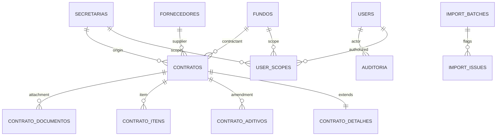

# Guia Técnico de Implementação — Laravel + Livewire + Alpine + Docker

**Status:** diretriz de implementação, não representa repositório de aplicativo pronto.  
**Uso:** orientar equipe de desenvolvimento ou Codex CLI.  
**Referência funcional:** `01_ESPECIFICACAO_FUNCIONAL_E_TECNICA.md`.

## 1. Escolhas arquiteturais

### 1.1 Monólito Laravel com camadas

Organizar responsabilidades:

- **Livewire Components:** coordenam estado da UI, validação de entrada e chamadas para Services; jamais decidem sozinhos autorização.
- **Form Objects / Form Requests:** entrada tipada, mensagens em pt-BR e regras de preenchimento.
- **Policies:** autenticação e autorização por papel, fundo, secretaria e ação específica.
- **Services:** criam/atualizam contratos e usuários com transação, locking, auditoria, fluxo de soft delete/restauração.
- **Domain/Value Objects:** dinheiro decimal, documentos CPF/CNPJ, vigência temporal, identificadores históricos.
- **Models Eloquent:** tabelas novas normalizadas, relacionamentos reais e casts corretos.
- **Importers/Reconcilers:** leem legado, tipificam dados, preservam raw e apontam erros; não dependem de componentes Livewire.
- **Report Exports:** consultam via query filtrada por Policy, geram PDF/XLSX/CSV.

### 1.2 Fluxo de CRUD

```mermaid
sequenceDiagram
    actor U as Usuário
    participant L as Livewire
    participant P as Policy
    participant S as ContractService
    participant D as MariaDB
    U->>L: Envia formulário
    L->>P: authorize(create/update/delete, contrato)
    P-->>L: Permissão + escopo
    L->>L: Validação server-side
    L->>S: DTO tipado
    S->>D: BEGIN; grava contrato + detalhes
    S->>D: registra auditoria e versão
    S->>D: COMMIT
    S-->>L: Resultado / conflitos
    L-->>U: Confirmação e ficha atualizada
```

**Regra:** se falhar autorização, validação, escrita ou auditoria, a operação inteira deve ser revertida quando cabível.

## 2. Versões e instalação inicial (orientação)

Verificar dependências e suporte imediatamente antes de instalar.

```bash
# Criar aplicação em diretório limpo; usar Laravel 13 e PHP 8.3+
composer create-project laravel/laravel gestao-contratos "^13.0"
cd gestao-contratos

# Framework reativo e componentes UI
composer require livewire/livewire:^4.0
composer require livewire/flux

# Frontend / build
npm install
npm run build

# Depois de configurar .env e disponibilizar o banco
php artisan key:generate
php artisan migrate
php artisan test
```

**Compatibilidade:** Flux atual exige Tailwind CSS **4.2+** na configuração documentada. Livewire 4 já integra Alpine; não adicionar outra chamada global Alpine separada. Antes de fixar qualquer biblioteca adicional (XLSX/PDF, autorização, ícones), validar compatibilidade com Laravel 13 e o respectivo licenciamento. Evitar copiar instruções de plugins Laravel 11/12 que foram alteradas no 13.

Para ambiente Docker, executar os comandos dentro do serviço de aplicação/um container Composer, seguindo o Dockerfile e os scripts adotados. O exemplo acima indica dependências, não presume PHP/Composer instalados na máquina host.

## 3. Docker Compose — arquitetura de serviços

```text
                    +---------------------+
Browser --------->  | Nginx / proxy TLS   |
                    +----------+----------+
                               |
                         +-----v-----+
                         | app PHP    | <----+ Redis
                         | Laravel    | <----+ MariaDB
                         +-----------+
                                |
                         storage privado

worker (PHP Laravel) --- Redis/MariaDB
scheduler (Laravel) --- MariaDB
node/Vite ---------- apenas no desenvolvimento
mailpit ------------ apenas no desenvolvimento
```

### 3.1 Matriz de containers

| Serviço Compose | Ambiente | Responsabilidade | Persistência |
|---|---|---|---|
| `nginx` | Todos | Proxy HTTP, arquivos públicos, envio ao PHP-FPM | Somente configs |
| `app` | Todos | Aplicação Laravel PHP-FPM | `storage` conforme arquitetura |
| `db` | Local / homologação; prod se autogerenciado | MariaDB com `utf8mb4` | Volume/backup seguro |
| `redis` | Todos recomendado | Cache, sessões/filas conforme configuração | Configurar persistence conforme importância da fila |
| `worker` | Todos | Processamento de filas e exportações longas | Logs e storage compartilhado protegido |
| `scheduler` | Todos | Eventos agendados do Laravel | Sem storage próprio |
| `node` | Desenvolvimento | Vite/HMR | Nenhum persistente |
| `mailpit` | Desenvolvimento | Capturar e-mail de reset | Nenhum obrigatório |

### 3.2 Contrato de configuração

`.env.example` **sem credenciais reais** deve listar:

```ini
APP_NAME="Gestão de Contratos"
APP_ENV=local
APP_DEBUG=true
APP_URL=http://localhost
APP_TIMEZONE=America/Sao_Paulo
APP_LOCALE=pt_BR
DB_CONNECTION=mysql
DB_HOST=db
DB_PORT=3306
DB_DATABASE=gestao_contratos
DB_USERNAME=gestao_app
DB_PASSWORD=ALTERAR_PARA_VALOR_LOCAL
CACHE_STORE=redis
QUEUE_CONNECTION=redis
SESSION_DRIVER=database
REDIS_HOST=redis
MAIL_MAILER=smtp
MAIL_HOST=mailpit
MAIL_PORT=1025
FILESYSTEM_DISK=local
```

**Nota:** nomes/configuração final das variáveis devem refletir a versão do Laravel e o bootstrap real. `APP_KEY` deve ser gerada por instalação, nunca enviada com valor real no repositório. Em produção `APP_DEBUG=false`; secrets injetados por mecanismo próprio e TLS obrigatório.

### 3.3 Banco e migrações

- Banco novo `gestao_contratos`; criar tabelas pela migrations do Laravel.
- Restaurar fonte legada em um schema/banco **isolado**, com usuário **read-only** de importação (se necessário).
- Arquivo SQL é exportação completa, **não** migration do projeto novo; não rodar `php artisan migrate:fresh` em produção.
- Para verificar integridade do dump, executar contagem por tabela e comparar com o `02_DICIONARIO_DE_DADOS_SQL.md`.
- Use filtros de escopo no banco/query, não somente no HTML.
- Novos campos monetários `DECIMAL(18,4)` quando justificado; apresentação com 2 casas se aplicável, sem perda de precisão interna.

## 4. Design system inspirado em shadcn/ui

**Implementação:** Tailwind CSS + componentes Blade/Flux UI + Alpine para microinterações. Não migrar para Inertia/React a menos que a decisão de stack seja explicitamente alterada.

### 4.1 Tokens e direção visual

| Token | Padrão sugerido | Aplicação |
|---|---|---|
| `background` | Neutro claro/quase branco | Fundo geral |
| `foreground` | Cinza escuro/quase preto | Texto |
| `card` | Branco | Painel de conteúdo |
| `muted` | Cinza sutil | Descrições e áreas auxiliares |
| `border` | Cinza neutro e fino | Inputs, cards e tabelas |
| `primary` | Escuro com contraste alto | Ação principal |
| `destructive` | Vermelho contido | Exclusão/desativação |
| `ring` | Destaque acessível de foco | Teclado |
| `radius` | 8 a 10px | Controles e cards |

- A mesma escala de espaçamento, bordas, tamanhos de botão e labels em todos os módulos.
- Botão primário somente para ação principal da tela; ações destrutivas em modal confirmado.
- Tabs para seção detalhada, wizard para editar 80 campos, alertas discretos de pendência.
- Dark mode opcional se for previsto e testado; sem obrigatoriedade no MVP.

### 4.2 Componentes a criar

| Componente Blade / Flux | Detalhes |
|---|---|
| `ui/button` | Primário, secundário, outline, ghost, danger; loading e disabled |
| `ui/input` | label, hint, erro, ícone, `wire:model` |
| `ui/money-input` | Máscara BR apenas na UI; envia string válida para Value Object |
| `ui/date-input` | Exibe `dd/mm/aaaa`; converte ISO no servidor |
| `ui/select` | Busca de fundos, fornecedores e tipos com teclado |
| `ui/dialog` | Confirmar exclusão, atribuição de escopo, erro e foco |
| `ui/table` | Paginação, filtros, skeleton e ações com permissão |
| `ui/badge` | Ativo, vencido, indeterminado, em revisão |
| `ui/card` | KPIs e detalhes |
| `ui/empty-state` | Sem dados com ação contextual |
| `ui/toast` | Sucesso/falha com detalhes inteligíveis |
| `ui/tabs` | Organização do detalhe sem carregar tudo de uma vez |

### 4.3 Navegação

```text
[Sidebar]
  Visão geral
  Contratos
    Todos
    Novo contrato
    A vencer
  Relatórios
  Administração (somente admin)
    Usuários
    Auditoria
    Qualidade da migração
  Minha conta

[Topbar]
  Breadcrumbs                  Busca            Usuário/Sair
```

## 5. Estrutura sugerida de ações e classes

```text
app/Domain/Contracts/Models/Contract.php
app/Domain/Contracts/Models/ContractDetail.php
app/Domain/Contracts/Services/CreateContract.php
app/Domain/Contracts/Services/UpdateContract.php
app/Domain/Contracts/Services/DeleteContract.php
app/Domain/Contracts/Services/ComputeContractPeriod.php
app/Domain/Contracts/Data/ContractData.php
app/Domain/Legacy/Importers/ImportContracts.php
app/Domain/Legacy/Normalizers/BrazilianMoney.php
app/Domain/Legacy/Reconcilers/LinkAmendments.php
app/Domain/Reports/Services/ContractReportQuery.php
app/Domain/Reports/Jobs/GenerateReport.php
app/Policies/ContractPolicy.php
app/Policies/UserPolicy.php
app/Livewire/Contracts/Index.php
app/Livewire/Contracts/Create.php
app/Livewire/Contracts/Edit.php
app/Livewire/Contracts/Show.php
app/Livewire/Users/Index.php
app/Livewire/Reports/Index.php
```

Nomes de classe são exemplos; o framework pode gerar componentes Livewire em arquivos únicos/múltiplos. Escolher **um padrão** documentado, sem misturar versões do Livewire arbitrariamente.

## 6. Contratos de dados e API interna

- `ContractData`: dados validados tipados e normalizados, preservando IDs e snapshots.
- `BrazilianMoney::parse`: recebe string de entrada e devolve decimal ou erro formal; nunca `float`.
- `ContractPeriod::effectiveEnd`: retorna data e **fonte da data** (`imported_updated`, `original`, `amendment_reviewed`, `unknown`).
- `ContractStatus::derive`: recebe data de referência e flags administrativas; distingue temporal do administrativo.
- `Reconciler::match`: resultado `matched` / `ambiguous` / `unmatched` / `manual_confirmed`, com justificativa.
- `ContractReportQuery`: sempre recebe usuário autenticado e escopos, não expõe query sem autorização.
- Serviços de exclusão e restauração exigem motivo/ator, soft delete e evento auditado.

## 7. Modelo de bancos — diagrama ER conceitual



**Ressalva:** referências legadas podem inicialmente ficar sem vínculo (`contrato_id NULL`) e gerar pendência. Os nomes são da arquitetura nova, não tabelas existentes do dump.

## 8. Política de logs, backup e arquivos

- Armazenamento de contratos e anexos restrito, não em `public/` por padrão; download autenticado + auditado.
- PDFs gerados com nome aleatório e validade, evitando exposição por URL previsível.
- Hash dos arquivos importados/anexados; impedir execução de arquivos por upload.
- Retenção e descarte conforme classificação documental e regras locais; **soft delete não é permissão para destruição de arquivo público**.
- Backup do banco + storage + chaves de criptografia guardadas em local seguro; restaurar periodicamente em ambiente isolado.
- Logs de modificação de contratos devem registrar identificação do registro, mudança, data e ator, respeitando minimização de dados pessoais.

## 9. Integração com o SQL legado — contrato do importador

```text
Entrada: dump SQL legado + checksum conhecido
Etapa 1: leitura e validação de schema/encoding
Etapa 2: importação de catálogos e snapshots
Etapa 3: importação dos 80 campos contratuais
Etapa 4: importação de aditivos, itens e referências
Etapa 5: reconciliação por identificadores múltiplos
Etapa 6: relatório de contagem, divergências e decisões pendentes
Saída: banco novo + histórico de importação + relatório de qualidade
```

**Não reutilizar senhas legadas.** Não executar um `INSERT` de `tb_Usuario` diretamente em `users`. Não escrever reconciliação que escolhe silenciosamente o primeiro registro encontrado por número de contrato.

## 10. Referências e documentação externa

- Laravel 13: https://laravel.com/docs/13.x/releases
- Laravel frontend/Blade: https://laravel.com/docs/13.x/frontend
- Livewire 4 (inclui instrução para evitar Alpine duplicado): https://livewire.laravel.com/docs/4.x/installation
- Flux UI: https://fluxui.dev/docs/installation
- Shadcn (integração oficial para Laravel **com React**): https://ui.shadcn.com/docs/installation/laravel
- Docker Laravel guide: https://docs.docker.com/guides/laravel/

**Fim.** O código da aplicação não foi criado nesta etapa. Este guia e os demais documentos definem o que implementar, em que sequência e como validar.
